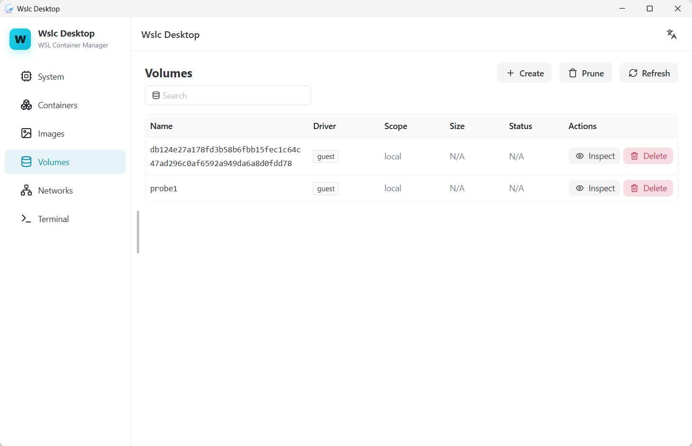
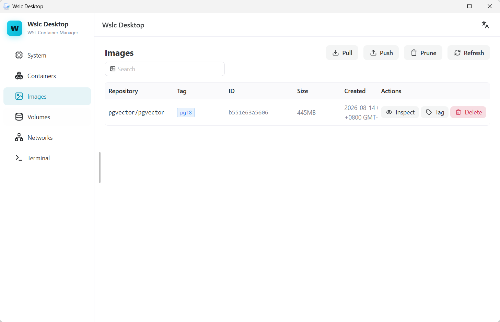
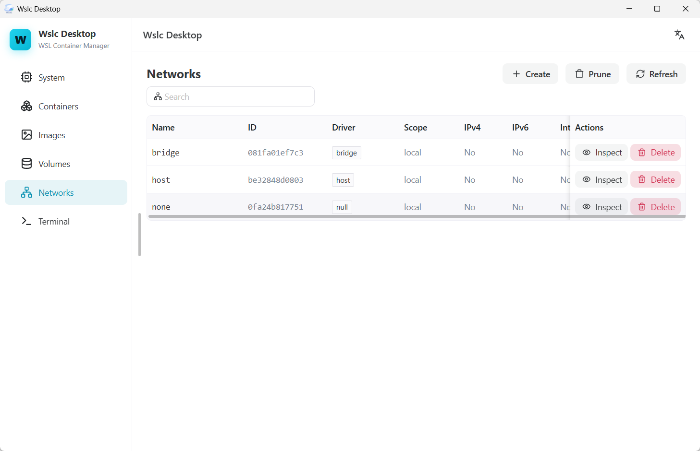

<div align="center">

# Wslc Desktop

**面向 Windows 的 WSL 容器图形化桌面管理器。**

[](https://learn.microsoft.com/windows/wsl/)
[](https://v3.wails.io/)
[](https://go.dev/)


[English](../README.md) | **简体中文**

</div>

---

## 项目简介

Wslc Desktop 把微软官方的 [`wslc`](https://learn.microsoft.com/windows/wsl/) 命令行工具包装成原生
Windows 桌面应用，日常容器运维不再需要背命令。

基于 Wails v3、Go 与 Vue 3 构建。

## 应用截图

| 卷 | 镜像 | 网络 |
| --- | --- | --- |
|  |  |  |

## 功能特性

- **系统状态** – WSL 可用性与版本、`wslc` 守护进程状态
- **容器** – 列表、搜索、按状态筛选、启动、停止、重启、强杀、删除、日志、资源占用、清理
- **镜像** – 列表、搜索、拉取、推送、重新打标签、删除、清理
- **卷** – 列表、搜索、创建、删除、清理
- **网络** – 列表、搜索、创建、删除、清理
- **命令终端** – 执行任意 `wslc` 子命令并查看输出
- 中英文界面，浅色主题

## 环境要求

- Windows 10（1809 及以上）或 Windows 11
- 已启用 WSL 2，且 `wslc` CLI 已在 `PATH` 中
- [Go](https://go.dev/dl/) 1.25 或更高版本
- [Node.js](https://nodejs.org/) 20 或更高版本
- [Wails v3 CLI](https://v3.wails.io/getting-started/installation/)：
  `go install github.com/wailsapp/wails/v3/cmd/wails3@latest`

## 使用

只需两个核心命令：

```bash
# 开发模式，前后端均支持热更新
wails3 dev

# 生产构建 -> bin/wslc-desktop.exe
wails3 build
```

### 指定 CPU 架构打包

默认目标架构为 `amd64`。传入 `ARCH` 即可交叉编译；非 `amd64` 会自动在文件名后附加架构后缀，
因此多种架构的产物可以共存于 `bin/`。

```bash
wails3 task build ARCH=arm64              # -> bin/wslc-desktop-arm64.exe
wails3 task package ARCH=arm64            # 生成 arm64 的 NSIS 安装包
wails3 task build:all                     # 同时构建 amd64 与 arm64
wails3 task package:all                   # 同时生成两种架构的 NSIS 安装包
```

`bin/` 产物说明：

| 文件 | 说明 |
| --- | --- |
| `wslc-desktop.exe` | amd64 可执行文件 |
| `wslc-desktop-arm64.exe` | arm64 可执行文件 |
| `wslc-desktop-AMD64-installer.exe` | amd64 NSIS 安装包 |
| `wslc-desktop-ARM64-installer.exe` | arm64 NSIS 安装包 |

## 参与贡献

- 发现 Bug？[提交 Issue](https://github.com/JFeng2048/Wslc-Desktop/issues/new?labels=bug)
- 需要新功能？[提交 Issue](https://github.com/JFeng2048/Wslc-Desktop/issues/new?labels=enhancement)
- 想贡献代码？[Fork 本仓库](https://github.com/JFeng2048/Wslc-Desktop/fork)，创建分支后
  [发起 Pull Request](https://github.com/JFeng2048/Wslc-Desktop/pulls/new)
- 有疑问？[发起讨论](https://github.com/JFeng2048/Wslc-Desktop/discussions)

## 许可协议

本项目尚未声明开源许可证。在许可证确定之前，著作权归作者所有。若你计划再分发本项目代码或基于其
二次开发，请先[提交 Issue](https://github.com/JFeng2048/Wslc-Desktop/issues/new)沟通。

## 作者

**JFeng2048** — [GitHub](https://github.com/JFeng2048) · [JFeng2048@outlook.com](mailto:JFeng2048@outlook.com)
